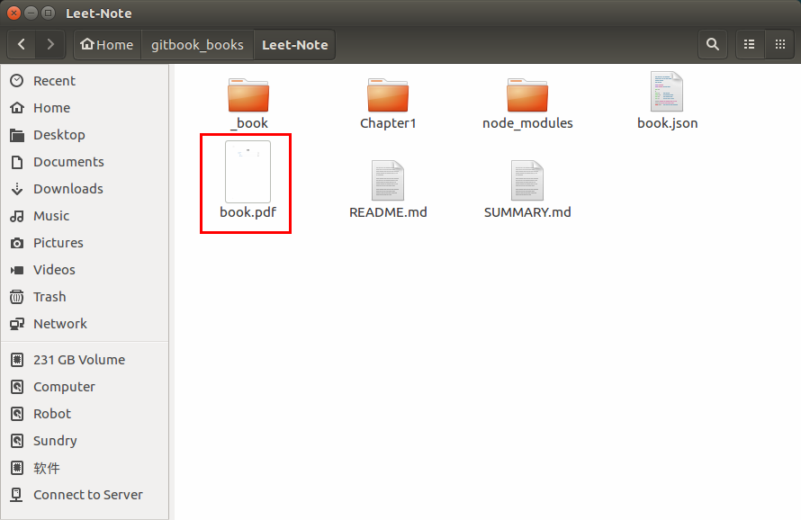

# gitbook转换成pdf格式文件

* 用vscode写markdown文档，虽然vscode中有markdown转pdf的插件,但是效果一般,格式有时会错乱。 
* 另外，用markdown格式写出来的文档比较直观易看，使用gitbook可以让我随时随地记录我的学习历程。所以最终的目的还是将gitbook转换成pdf文件。

**前提要求：git ， gitbook已经安装并正常使用**

**配置要求：**
 - **ubuntu系统**
 - **calibre**

**配置步骤：**
1. 安装`node.js`  
[node.js官网](https://nodejs.org/en/)  
安装完成之后，可以使用如下命令检验是否安装成功
```
node -v
返回结果是版本号，类似于：v12.16.2
```
2. 安装`calibre`  (此命令行来自官网)  
[calibre官网](https://calibre-ebook.com/download_linux)
```
sudo -v && wget -nv -O- https://download.calibre-ebook.com/linux-installer.sh | sudo sh /dev/stdin
```
因为使用到了`wget`，所以，如果系统没有安装`wget`，那么必须先安装`wget`
```
sudo apt install wget
```
3. 安装`Calibre`格式转换工具 `ebook-convert`
```
npm install ebook-convert -g 
```
4. 成功完成上述步骤之后，就可以进行转换了  
 1. 首先`cd`进入需要把gitbook转换为pdf文件的文件夹
 2. 然后执行如下命令,生成gitbook文件：
```
gitbook install
gitbook serve 
```
 3. 最后，执行格式转换指令：
```
gitbook pdf
```
OK,在当前文件夹下就已经生成了一个名为`book.pdf`的文件了。  
如图所示：  
